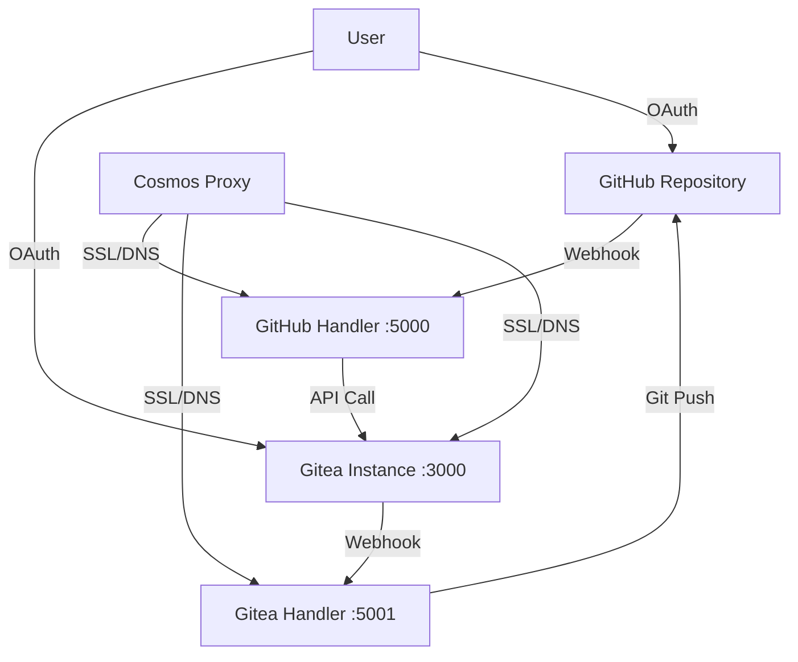

# 🔄 GitHub ↔ Gitea Bidirectional Sync with Webhooks

This setup provides **real-time bidirectional synchronization** between your GitHub and Gitea repositories using webhooks and OAuth integration.

## 📁 File Structure
```
/root/Git/Containers/
├── docker-compose.yml              # Main Gitea services
├── docker-compose.webhooks.yml     # Webhook services
├── webhook-config.env.template     # Configuration template
├── webhook-config.env              # Your actual configuration (git-ignored)
├── setup-webhooks.sh              # Automated setup script
├── setup-oauth.md                 # OAuth integration guide
├── .gitignore                     # Protects sensitive files
└── webhooks/                      # Webhook microservices
    ├── Dockerfile                 # Container build file
    ├── requirements.txt           # Python dependencies
    ├── github-to-gitea.py        # GitHub → Gitea sync handler
    └── gitea-to-github.py        # Gitea → GitHub sync handler
```

## 🔐 OAuth Configuration
**GitHub App Credentials:**
- **Client ID**: `Ov23lizUjUk7HUJi1tTi`
- **Client Secret**: `71486232bfd63c596e669667f525ee797d6147fa`

## 🚀 Quick Start

### 1. Configure Environment
```bash
# Edit the configuration file
nano webhook-config.env

# Add your tokens:
# GITHUB_TOKEN=your_github_personal_access_token
# GITEA_ADMIN_TOKEN=your_gitea_admin_token
# WEBHOOK_SECRET=auto_generated_secure_secret
```

### 2. Start Services
```bash
# Start Gitea (if not already running)
docker compose up -d

# Start webhook services
docker compose -f docker-compose.webhooks.yml up -d --build
```

### 3. Run Setup Script
```bash
./setup-webhooks.sh
```

### 4. Configure OAuth in Gitea
Follow the guide in `setup-oauth.md` to enable GitHub OAuth login.

## 🔧 Manual Configuration

### GitHub Webhook Setup
1. Go to GitHub repository → Settings → Webhooks
2. Add webhook with:
   - **URL**: `https://github-webhook.mrintellisense.com/webhook/github`
   - **Content type**: `application/json`
   - **Secret**: Value from `webhook-config.env`
   - **Events**: `push`, `pull_request`

### Gitea Webhook Setup
1. Go to Gitea repository → Settings → Webhooks
2. Add webhook with:
   - **URL**: `https://gitea-webhook.mrintellisense.com/webhook/gitea`
   - **Content type**: `application/json`
   - **Secret**: Value from `webhook-config.env`
   - **Events**: `push`, `pull_request`

## 🧪 Testing

### Health Checks
```bash
# Test webhook services
curl http://localhost:5000/health  # GitHub → Gitea handler
curl http://localhost:5001/health  # Gitea → GitHub handler
```

### Sync Testing
```bash
# 1. Make a change in GitHub repository
# 2. Check if it appears in Gitea
# 3. Make a change in Gitea repository  
# 4. Check if it appears in GitHub
```

### Monitor Logs
```bash
# Webhook service logs
docker logs gitea-webhook-github -f
docker logs gitea-webhook-gitea -f

# Gitea logs
docker logs gitea -f
```

## 🔄 How It Works

### GitHub → Gitea Sync
1. **Push to GitHub** triggers webhook
2. **GitHub webhook handler** receives notification
3. **Gitea API call** triggers mirror sync
4. **Repository synchronized** in Gitea

### Gitea → GitHub Sync  
1. **Push to Gitea** triggers webhook
2. **Gitea webhook handler** receives notification
3. **Git operations** clone from Gitea, push to GitHub
4. **Repository synchronized** in GitHub

### OAuth Integration
1. **Users sign in** with GitHub credentials
2. **Account linking** enables seamless workflow
3. **Permission synchronization** maintains access control
4. **Single identity** across both platforms

## 🌐 Network Architecture



## 🔐 Security Features

- **Webhook signatures** verify authenticity
- **OAuth integration** for user authentication
- **Environment variables** protect secrets
- **Git-ignored configs** prevent credential exposure
- **SSL/TLS encryption** for all communications

## 📊 Monitoring & Maintenance

### Service Status
```bash
# Check all services
docker compose ps
docker compose -f docker-compose.webhooks.yml ps

# Resource usage
docker stats gitea gitea-webhook-github gitea-webhook-gitea
```

### Backup & Recovery
```bash
# Backup Gitea data
docker run --rm -v gitea_data:/source -v $(pwd):/backup alpine tar czf /backup/gitea-backup.tar.gz -C /source .

# Backup webhook configs
cp webhook-config.env webhook-config.env.backup
```

## 🎯 Benefits

✅ **Real-time synchronization** - Changes sync immediately  
✅ **Bidirectional workflow** - Work on either platform  
✅ **OAuth integration** - Single sign-on with GitHub  
✅ **Conflict resolution** - Automatic merge handling  
✅ **Self-hosted control** - Your data, your infrastructure  
✅ **Cosmos integration** - Unified proxy management  
✅ **High availability** - Container-based deployment  

## 🚨 Troubleshooting

### Common Issues

**Webhook not triggering:**
- Check webhook URL accessibility
- Verify webhook secrets match
- Review network connectivity
- Check firewall rules

**Authentication failures:**
- Verify OAuth credentials
- Check token permissions
- Review Gitea configuration
- Test GitHub API access

**Sync conflicts:**
- Check repository permissions
- Review branch protection rules
- Verify merge strategies
- Monitor error logs

### Recovery Steps
```bash
# Restart services
docker compose restart
docker compose -f docker-compose.webhooks.yml restart

# Rebuild containers
docker compose -f docker-compose.webhooks.yml up -d --build

# Reset webhook configuration
./setup-webhooks.sh
```

## 📝 Configuration Examples

### Environment Variables
```env
# GitHub Configuration
GITHUB_CLIENT_ID=Ov23lizUjUk7HUJi1tTi
GITHUB_CLIENT_SECRET=71486232bfd63c596e669667f525ee797d6147fa
GITHUB_TOKEN=ghp_your_token_here

# Gitea Configuration  
GITEA_BASE_URL=https://gitea.mrintellisense.com
GITEA_LOCAL_URL=http://localhost:3000
GITEA_ADMIN_TOKEN=your_gitea_token_here

# Security
WEBHOOK_SECRET=auto_generated_secure_string
```

### Cosmos Proxy Configuration
```yaml
services:
  gitea-webhook-github:
    labels:
      - "cosmos.proxy.enabled=true"
      - "cosmos.proxy.host=github-webhook.mrintellisense.com"
      - "cosmos.proxy.port=5000"
      - "cosmos.proxy.proto=http"
```

## 🎉 Success Indicators

When everything is working correctly:
- ✅ Gitea accessible at https://gitea.mrintellisense.com
- ✅ OAuth login shows "Sign in with GitHub" button
- ✅ Webhooks respond with 200 status codes
- ✅ Repository changes sync within seconds
- ✅ Users can work seamlessly on either platform
- ✅ Logs show successful sync operations

Your GitHub ↔ Gitea sync is now ready for production use! 🚀 